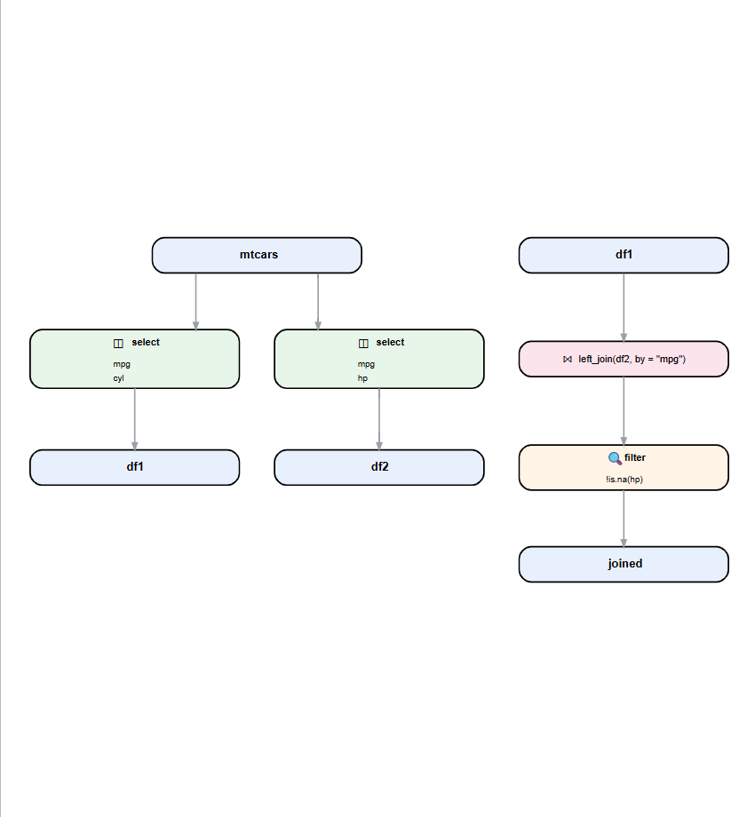

<!-- README.md is generated from README.Rmd. Please edit that file -->

```{r, include = FALSE}
knitr::opts_chunk$set(
  collapse = TRUE,
  comment = "#>",
  fig.path = "man/figures/README-",
  out.width = "100%"
)
```

# pipevizR

<!-- badges: start -->

<!-- badges: end -->

pipevizR is an R package for creating visual dataflow diagrams from dplyr pipeline code. This is meant to help data scientists with tracing data lineage on complex projects.


