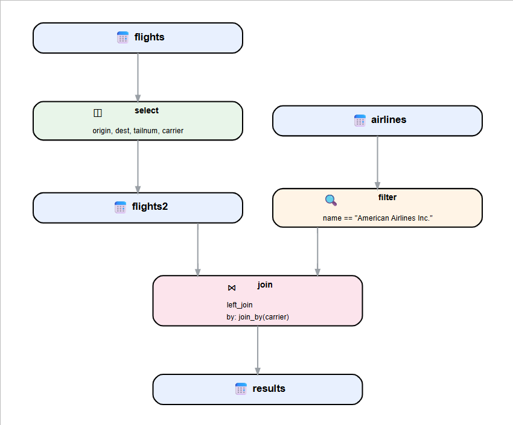

<!-- README.md is generated from README.Rmd. Please edit that file -->

# pipevizR

<!-- badges: start -->

<!-- badges: end -->

pipevizR is an R package for creating visual dataflow diagrams from
dplyr pipeline code. This is meant to help data scientists with tracing
data lineage on complex projects.

## Installation

This package is in development and not yet on CRAN. You can install the
DEV version directly from GitHub:

``` r
remotes::install_github("pebenbow/pipevizr")
```

## Usage

Load the package using the `library()` function:

``` r
library(pipevizr)
```

pipevizr can visualize a single pipeline by invoking `pipe_vizr()`:

``` r
pipe_vizr(
  output <- mtcars %>%
    select(mpg, disp, wt) %>%
    filter(wt > 2),
  direction = "TB"
)
```

Or it can visualize all detectable pipeline code in a given file by way
of `pipe_vizr_file()`:

``` r
pipe_vizr_file(
  file = "test_pipeline.R",
  direction = "TB"
)
```

It is tolerant of both base R pipes (`|>`) and magrittr pipes (`%>%`).


